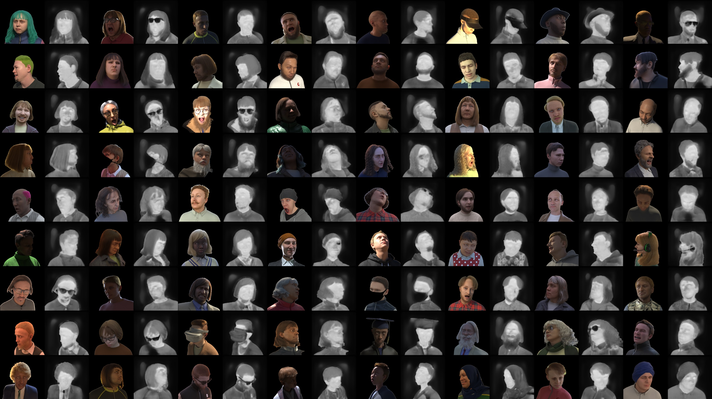
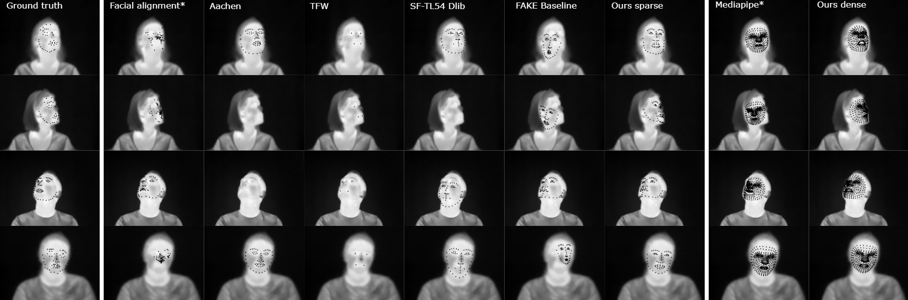

# T-FAKE: Synthesizing Thermal Images for Facial Landmarking


## Downloading the dataset

To download the color images, sparse annotations, and segmentation masks for the dataset, please use the links in the [FaceSynthetics repository](https://github.com/microsoft/FaceSynthetics).

Our dataset has been generated for a warm and for a cold condition. Each dataset can be downloaded separately as

- A small sample with 100 images from [here warm](https://drive.google.com/file/d/1-Y40_wqVV5WM1swEpjFTJiB8sGdZtQwR/view?usp=sharing) and [here cold](https://drive.google.com/file/d/1-_-RHg7ZDzFFtoyeXJsyrdtgkcnJ3FMR/view?usp=sharing)
- A medium sample with 1,000 images from [here warm](https://drive.google.com/file/d/1-NcsaNa6dbfmQ0l6UjmwZSJWDsUFM4vW/view?usp=sharing) and [here cold](https://drive.google.com/file/d/1-PqPR86GDj5LB_6PZKlek6o6FNbkf7Fo/view?usp=sharing)
- The full dataset with 100,000 images from [here warm](https://drive.google.com/file/d/1-3-OC-VYL14uyLA4Vi9DpwDlkauuNh7K/view?usp=sharing) and [here cold](https://drive.google.com/file/d/1wh25Yi9sT-0j6qXz0JlHUtIIbLAYUnrZ/view?usp=sharing)
- The dense annotations are available from [here](https://drive.google.com/file/d/1-lMYaok0xbfQyBTxj6dcuxT1iryU7TOs/view?usp=sharing)

## Using the landmarker

Coming soon.



## Pre-trained models

The models for the thermalization as well as the landmarkers can be downloaded from [here](https://drive.google.com/drive/folders/1-ppKS4xuBY-EbmGCkvKTLYMXHA3lK8R8?usp=sharing).

### Thermalization


### Landmarking

## Running the benchmark

To run the benchmark, you have to download the [CHARLOTTE ThermalFace dataset](https://github.com/TeCSAR-UNCC/UNCC-ThermalFace). 


## License

This dataset and the landmarking methods are licensed under the [Attribution-NonCommercial-ShareAlike 4.0 International](LICENSE.txt) license as it is derived from the [FaceSynthetics dataset](https://github.com/microsoft/FaceSynthetics).

## Citation

If you use this code for your own work, please cite our paper:
  
> P. Flotho, M. Piening, A. Kukleva and G. Steidl, “T-FAKE: Synthesizing Thermal Images for Facial Landmarking,” arxiv, 2024. [doi:10.48550/arXiv.2408.15127](https://doi.org/10.48550/arXiv.2408.15127)

BibTeX entry
```
@article{flotea2024a,
    author = {Flotho, P. and Piening, M. and Kukleva, A. and Steidl, G.},
    title = {T-FAKE: Synthesizing Thermal Images for Facial Landmarking},
    year = {2024},
    journal = {arXiv preprint arXiv:2408.15127},
    doi = {https://doi.org/10.48550/arXiv.2408.15127}
}
```
